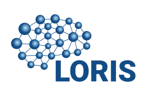

# LORIS Neuroimaging Platform

LORIS (Longitudinal Online Research and Imaging System) is a self-hosted web application that provides data- and project-management for neuroimaging research. LORIS makes it easy to manage large datasets including behavioural, clinical, neuroimaging and genetic data acquired over time or at different sites.

* Try the LORIS demo instance at https://demo.loris.ca.

## Installation

Consult the [Ubuntu Installation guide](docs/wiki/00_SERVER_INSTALL_AND_CONFIGURATION/01_LORIS_Install/Ubuntu/README.md) or [CentOS Installation guide](docs/wiki/00_SERVER_INSTALL_AND_CONFIGURATION/01_LORIS_Install/CentOS/README.md) for more information.

These installation instructions and more LORIS documentation for developers can also be found on the [LORIS ReadTheDocs website](https://acesloris.readthedocs.io/en/latest/).

## Community

### Get in touch
For questions and troubleshooting guidance beyond what is covered in our documentation, please subscribe to the [LORIS Developers mailing list](http://www.bic.mni.mcgill.ca/mailman/listinfo/loris-dev) and email us there. 

### Support and GitHub Issues
For troubleshooting specific installation issues or errors, please see the [Installation troubleshooting guide](docs/wiki/00_SERVER_INSTALL_AND_CONFIGURATION/01_LORIS_Install/Troubleshooting.md), and then contact us via the [LORIS Developers mailing list](http://www.bic.mni.mcgill.ca/mailman/listinfo/loris-dev).
For bug reporting and new feature requests, please search and report via our GitHub Issues. 

Please include details such as the version of LORIS you're using as well as information
such as the OS you're using, your PHP and Apache versions, etc.

## Contributing

We are very happy to get code contributions and features from the global LORIS community. 

If you would like to contribute to LORIS development, please consult our [Contributing Guide](./CONTRIBUTING.md).

## Powered by MCIN

LORIS is made by staff developers at the [McGill Centre for Integrative Neuroscience](http://www.mcin.ca), led by Alan Evans and Samir Das at The Neuro (Montreal Neurological Institute-Hospital).

Visit [the LORIS website](https://loris.ca) for the history of LORIS and our **Technical Papers**.

The original (pre-GitHub) LORIS development team from 1999-2010 included: Dario Vins, Alex Zijdenbos, Jonathan Harlap, Matt Charlet, Andrew Corderey, Sebastian Muehlboeck, James McKinney, and Samir Das.
