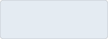
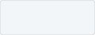
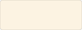
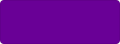
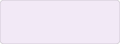
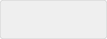
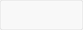

# Design system

This document covers how LORIS looks and how to style something new. The values themselves live in
[`htdocs/css/tokens.css`](../htdocs/css/tokens.css), which every page loads. See
[CodingStandards.md](CodingStandards.md) for language conventions.

## Principles

**Serious, not severe.** People use LORIS to find data they will build papers on. Nothing should read
as playful or provisional. That means restraint rather than greyness: one accent colour, generous
spacing, and no decoration that is not carrying information.

**Familiar before novel.** LORIS is deployed at institutions that trained their staff on it. A change
that makes people relearn where things are has failed however good it looks. Improve the quality of a
control, and keep its position and its meaning.

**Density is a feature.** This is data software, and users want more on screen rather than less. Size
controls to their content. Do not spend vertical space on decoration.

**One component, used everywhere.** Every bespoke control becomes a future inconsistency. When a
shared component cannot do what you need, extend it so the whole application gains the capability. A
change that touches many screens because one component improved is a good change.

## Never hardcode a value

Colours, spacing, radii and shadows come from `tokens.css`. If you are typing a hex value or a pixel
measurement into a component, stop and use a token. If no token fits, add one. That is a signal the
system was missing something, not that your component is special.

```css
/* No */
.thing { background: #eaf1f8; border-radius: 4px; padding: 8px; }

/* Yes */
.thing {
    background: var(--loris-color-accent-fill);
    border-radius: var(--loris-radius);
    padding: var(--loris-space-md);
}
```

### Two layers, and only one of them is for you

`tokens.css` holds a **palette** naming colours for what they are (`--loris-blue-700`,
`--loris-grey-300`) and **roles** naming them for the job they do (`--loris-color-accent`,
`--loris-border`, `--loris-text-muted`).

**Components reference roles, never the palette.** Repointing a role then restyles everything that
plays that part, instead of requiring a search through components. Adding a palette entry is rare and
deliberate. It means LORIS genuinely has a new colour.

### Three strengths of a colour

A hue is used at up to three strengths, and the role names say which job each one does.

| Strength | What it is | Used for |
|---|---|---|
| **solid** | The colour itself | A border, an icon, a filled button, text |
| **fill** | A tint you can see is coloured | The ground something sits on: a selected row, a tag |
| **highlight** | Barely there | Hover, and nothing else |

A hue gets a step because something needs it, not for symmetry. Only the blue has all three: it is
the only one that draws a hover, and the highlight exists for nothing else.

## Colour

This is not starting from nothing. `htdocs/bootstrap/css/custom-css.css` has carried a header called
"Loris color palette v.0.1" for years, declaring two blues and an orange. It stalled because it lived
in a comment where no code could reference it, and because it handed everything else to Bootstrap.
What follows makes it real.

### Blue, the primary

The two declared blues anchor the scale. The darkest is already the pressed state of every primary
button, and the two lightest are the tints used for highlights and hovered rows.

| | Token | Hex | Used for |
|---|---|---|---|
|  | `--loris-blue-900` | `#042d54` | Pressed |
|  | `--loris-blue-700` | `#064785` | Navigation, panel headings |
|  | `--loris-blue-500` | `#246eb6` | Lighter blue |
|  | `--loris-blue-100` | `#e4ebf2` | Fill, selected row |
|  | `--loris-blue-50` | `#f3f6f9` | Highlight, hovered row |

### Sky, the information colour

The same hue as the navy carried light and saturated instead of dark. This is not a new colour: the
biobank has drawn its live layer in it for years, with `.node.available`, `.node.selected` and its
hover borders all `#a6d3f5` against the navy for what is already filled. What is new is that it has
a name and a second step.

Two steps, and it should stay at two. A third would be a highlight, its highlight works out at
`#edf6fd` against `#f3f6f9` for the accent's, and a difference of 6, 0, 4 is not a difference. It
needs none in any case: a highlight only ever means hover, and hover belongs to the accent.

| | Token | Hex | Used for |
|---|---|---|---|
|  | `--loris-sky` | `#a6d3f5` | Help, notices, a standing rule |
|  | `--loris-sky-100` | `#d6eafa` | Information ground |

### Orange, the secondary

The attention colour, and the scarce one. It marks a state the interface is only passing through, or
one that is governing what other actions will do: the run a drag is sweeping over, a rule now
standing, a switch that is on. Two steps, because it never draws a hover, and no darker one.
Darkening an orange this saturated makes it look burnt rather than deep.

| | Token | Hex | Used for |
|---|---|---|---|
|  | `--loris-orange` | `#e89a0c` | Active border, switch that is on |
|  | `--loris-orange-100` | `#fdf2dc` | Active ground |

### Purple, the tertiary

Present in electrophysiology as an event badge. It carries no fixed meaning, which makes it the one
available for telling categories apart where blue and orange are already spoken for. Two steps, for
the same reason as the orange. The middle tints of a purple this saturated turn fuchsia.

| | Token | Hex | Used for |
|---|---|---|---|
|  | `--loris-purple` | `#690096` | Categorical |
|  | `--loris-purple-100` | `#f2e6f7` | Categorical ground |

### Semantic colours

These are named for the colour they are, because their meanings are already fixed. Red means
something failed wherever it appears. What matters is that it is the same red everywhere.

| | Token | Hex | Meaning |
|---|---|---|---|
|  | `--loris-green` | `#0f9d58` | Success |
|  | `--loris-red` | `#c0402a` | Error |
|  | `--loris-amber` | `#d17a00` | Warning |
|  | `--loris-sky` | `#a6d3f5` | Information |

Warning is deliberately not the same orange as the secondary. If a standing rule were the colour of
a warning, neither would mean anything.

### Grey

| | Token | Hex |
|---|---|---|
|  | `--loris-grey-1000` | `#000000` |
|  | `--loris-grey-800` | `#333333` |
|  | `--loris-grey-600` | `#666666` |
|  | `--loris-grey-500` | `#999999` |
|  | `--loris-grey-300` | `#cccccc` |
|  | `--loris-grey-250` | `#dddddd` |
|  | `--loris-grey-150` | `#efefef` |
|  | `--loris-grey-50` | `#f8f8f8` |
|  | `--loris-white` | `#ffffff` |

### Colours being retired

| Colour | Where it is | What happens to it |
|---|---|---|
| `#093782` | `modules/biobank`, `modules/dqt` | A second navy, a shade off `--loris-blue-700`. Use the token. |
| `#ff9a24` | `modules/dqt` | Use `--loris-orange`. |
| `#e98430` | `modules/biobank` | Use `--loris-orange`. |
| `#d54a08` | `modules/electrophysiology_browser` | Use `--loris-orange`. |
| `#fa5705` | `modules/brainbrowser` | Use `--loris-orange`. |

Four oranges for one idea, in four modules, none of them the orange the palette declares.

`#1c70b6` is a separate case and is not on this list. It is the blue bootstrap itself is compiled
with, recorded in `htdocs/bootstrap/config.json`, so it is a deliberate choice rather than module
drift. It sits a shade off `--loris-blue-500`, and the two should be reconciled the next time
bootstrap is rebuilt rather than by editing the compiled stylesheet.

## The three states

A surface answers three questions, and it answers them the same way wherever it is. Use the state
roles rather than reaching for a hue, so that no two screens drift apart.

| State | Role | Says |
|---|---|---|
| **Hover** | `--loris-state-hover` | Where the pointer is. It follows the cursor, covers a lot of ground and goes as soon as the pointer moves, so it is the lightest step there is. |
| **Selected** | `--loris-state-selected`, `--loris-state-selected-solid` | What is chosen. It is settled, nothing is happening to it, and it sits one step up from hover in the same blue. |
| **Active** | `--loris-state-active`, `--loris-state-active-solid` | Something is being passed through rather than rested in, and is about to change on release. The only state drawn in the secondary, and deliberately rare. |

The distinction that matters, and the one that is easy to get wrong, is between **selected** and
**active**.

A ticked row in a dropdown is selected. It is a settled choice, it sits there, and it changes nothing
outside itself.

Active is **intermediary**: a state the interface is passing through rather than resting in, such as
the run a drag is sweeping over before the pointer comes up. Those rows are neither chosen nor idle,
they are about to change, and the stroke has to show its consequence while it is still being made.

A rule that is merely standing is not this, and the difference is worth holding onto. The switch that
makes every field added from now on take the visits currently chosen changes nothing you can see when
you throw it. What it changes is what the *next* action means, and that is **information**: it is
`--loris-color-info`, the sky, alongside help text and notices. Nothing is in flight, so nothing is
orange.

The test to apply: **is this on its way somewhere?** If it resolves the moment the user lets go, it is
active. If it will still be true tomorrow and governs what other actions do, it is information. If it
is simply a choice at rest, it is selected.

Spending the orange on ordinary selection is the failure mode. It is loud on purpose, and a screen
where everything chosen is orange has nothing left to say when something really is in flight.

Two more things follow:

**A button has no selected state**, because it is an action rather than something that can be
chosen. Its hover moves the outline and the label and leaves the ground where it is. Filling a
button on hover puts its label on a colour the label was never chosen against, and the orange in
particular carries neither white text nor its own.

**The navigation bar is the exception.** It sits on the dark blue, where no wash of the accent would
show at all, so it keeps the orange that `@accent-color-hover` declared for it. Nothing on a light
ground should follow it.

## Colour that carries meaning

LORIS is used all day by people who did not choose their monitor, in rooms with the lights on, and by
people who do not separate hues the way the person picking the colours does. Around one man in twelve
has some form of colour vision deficiency. None of that is an edge case in software someone uses for
their job.

Three rules, in the order they get broken.

### 1. Never let colour be the only difference

This is the one that matters most, and the one this system relies on. The state grounds are
deliberately close together: hover, selected and active sit within 1.1 of each other in contrast
terms, because they are washes rather than signals. That is fine, and only fine, because none of them
is carrying the meaning alone.

| State | The ground | What carries it besides the ground |
|---|---|---|
| Hover | `--loris-state-hover` | The pointer is on it. It is not information, it is feedback. |
| Selected | `--loris-state-selected` | A bar down the left edge, a heavier label, and a ticked control |
| Active | `--loris-state-active` | A bar down the left edge, and the buttons that will consume it change with it |
| Switch on | `--loris-color-info` | The thumb is at the other end of the track |

If you remove the colour from any row above, the interface still says the same thing. Build to that
test. A ground is an amplifier, never the message.

### 2. Text on a fill reaches 4.5:1

Every combination the system produces clears it with room to spare, because the fills are pale and
the text is dark. Measured:

| | Ratio |
|---|---|
| `--loris-text` on any state ground | 10.2 to 11.7 |
| `--loris-text-muted` on the hover ground | 5.3 |
| White on `--loris-color-accent` | 9.3 |
| `--loris-color-accent` on white | 9.3 |

The rule bites when someone reaches for a solid as a text colour. `--loris-orange` on white is
**2.3**, and `--loris-sky` on white is **1.6**. Neither is a text colour. They are grounds and marks.

### 3. A control's own shape reaches 3:1

A button, a track, a checkbox or a focus ring has to be findable against what is behind it, which is
a different requirement from the text inside it. This is where the pale colours fail, and it is not
optional:

| | Against white | |
|---|---|---|
| `--loris-sky` | 1.58 | fails |
| `--loris-grey-300` | 1.6 | fails |
| `--loris-orange` | 2.32 | fails |
| `--loris-blue-500` | 5.28 | passes |
| `--loris-grey-600` | 5.74 | passes |

So a control drawn in a pale colour needs an edge drawn in something that passes. The switch is the
worked example: its track is the sky when on and a grey when off, and both carry an inset ring
(`--loris-color-info-edge`, `--loris-control-off-edge`) so the control is findable whatever it is
doing. Draw the ring inside, with `inset`, so turning it on does not move anything.

There is a second reason the switch is built that way. The sky and the light grey it originally
replaced have relative luminances of 0.613 and 0.604 — near enough identical that on and off differed
in hue and in nothing else, which is to say they did not differ at all for a reader who cannot
separate the two. **Two states must never differ in hue alone.** Change the lightness too.

### When a colour has to move

If a value cannot meet these, change the value rather than the rule, and change it in `tokens.css` so
everything moves together. Adapting a hue's saturation or lightness to make it work is a normal thing
to do here, not a compromise.

## Type

LORIS inherited Bootstrap's Helvetica and Arial stack, which nobody chose and which shows a different
typeface depending on the operating system. Two deliberate choices replace it. Neither downloads
anything.

| Token | Face | Used for |
|---|---|---|
| `--loris-font-family` | The operating system's own interface face | Labels, descriptions, buttons, headings |
| `--loris-font-family-mono` | The system monospace | Identifiers |

### When to use the monospace

Monospace marks **a value someone might copy or transcribe**. It does not mark "a technical thing".
Used sparingly it tells a reader something. Used everywhere it stops meaning anything, and the page
gets louder for no benefit.

Use it for:

1. Identifiers a person reads character by character. PSCIDs, DCCIDs, visit labels, barcodes.
2. Values that get copied into another system, a spreadsheet or an email.
3. Raw stored values where the exact characters matter, such as a filename or a path.

Do not use it for:

1. Field and column names. Underscores and word shapes already make
   `alcohol_use_disorders_identification_testconcise_a_auditc_q1` unambiguous, so the monospace adds
   nothing and spends a signal that is then unavailable where it is needed.
2. Counts and summaries. `All (354)` describes a selection, it is not one of the values in it.
3. Anything a person reads as a sentence, including descriptions and help text.

The test to apply: **would someone need to reproduce these exact characters somewhere else?** If yes,
use the monospace. If they are only reading it, do not.

## Where styles live

| What | Where |
|---|---|
| Values shared by more than one component | `htdocs/css/tokens.css` |
| A component's own appearance | A stylesheet beside it, imported by it, such as `jsx/Select.css` |
| A module's own layout | `modules/<module>/css/`, imported by the JSX |
| Anything with a `:hover`, `:focus` or `:disabled` state | A stylesheet, never an inline style |

Inline styles cannot express states or media queries. Use them only for values computed at runtime.

## Bootstrap

LORIS is built on Bootstrap 3, which has had no security patches since 2019. It is not being removed,
because that would touch every module. **Do not build on it in new components.** Give a new component
its own appearance from tokens. Bootstrap continues to serve what it already serves, and its share
shrinks as components are replaced.

This is not only about the end of life date. Borrowing a Bootstrap class and then laying it out
differently puts you in a specificity fight. `.form-control` sets `display: block`, `.input-group`
sets `display: table`, and `.list-group-item.active` sets `z-index: 2`, all of which beat an equally
specific rule of your own on source order. If you have to override one, qualify the selector with the
element, as in `button.my-trigger`, rather than reaching for `!important`. If your component owns its
layout outright, the conflict does not arise at all.

## Components

The shared controls live in `jsx/` and take no label, form row or offset of their own, so they can be
placed anywhere.

- **`Select`** is a selection shown as a dropdown over a searchable list. It holds many values, or one
  with `multiple={false}`. Options can be grouped to order the most relevant first. Set `mono` when
  the options are identifiers.
- **`Textbox`** is a single line text input. With `search` it gains a magnifier and a control to clear
  it.
- **`Toggle`** is a boolean, drawn either as a switch or as a checkbox.
- **`Button`** performs an action, in one of four displays: `primary`, `secondary`, `quiet` or
  `danger`.

`Form.js` wraps these for use inside a form, adding the label, row and error message. If you need a
control outside a form, use the component directly rather than fighting the wrapper's layout.

### A prop, not a new component

Where two controls differ by one boolean, they are one component. A multiple selection is a select
with `multiple`. A search box is a text input with `search`. A switch and a checkbox are one boolean
with two displays. Splitting them is how a codebase ends up with several implementations of one idea.

## Labels on controls

`Select` and `Textbox` accept a `label` that sits inside the field while it is empty and rises onto
its top edge once it is not. The border carries a real gap for it, so the label needs no backdrop and
works on any colour behind it.

Use this in toolbars and dense control strips, where a row of labels would cost vertical space and
turn a toolbar back into a form. Do not use it in ordinary forms. A plain label above the field costs
nothing there and stays full size, and shrinking it trades legibility for tidiness that is not
scarce.

## Still open

These have not been decided. A change that touches them should say so rather than settle them
quietly.

1. Where `--loris-color-primary` applies. The navy is the brand colour but currently has no consumer,
   because actions all use the accent blue.
2. A density scale. Control heights are inherited at 34px rather than chosen.
3. Whether the information colour is right for help text and notices as well as for standing rules.
   The family was introduced for the second and is documented for all three, but only the standing
   rules have a consumer so far. If help surfaces end up wanting something else, this splits again.
4. Whether the purple takes any of this. It is currently only categorical, and no case has been
   named for it.
5. The hardcoded orange hover still in the navbar dropdowns at the top of `custom-css.css`. On the
   dark navbar the orange is right, but those menus open on white, where it does not have the
   contrast to be read. Fixing it means changing the most familiar surface in LORIS, so it is worth
   deciding rather than doing.
