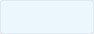
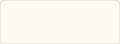
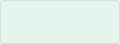
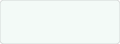
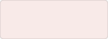

# Design system

The values LORIS styles itself with live in [`htdocs/css/tokens.css`](../htdocs/css/tokens.css),
which every page loads. This document says what is in there and how to use it. See
[CodingStandards.md](CodingStandards.md) for language conventions.

## Never hardcode a value

Colours, spacing and radii come from `tokens.css`. If no token fits, add one.

```css
/* No */
.thing { background: #eaf1f8; border-radius: 4px; padding: 8px; }

/* Yes */
.thing {
    background: var(--loris-color-accent-fill);
    border-radius: var(--loris-radius);
    padding: var(--loris-space-md);
}
```

## Two layers

`tokens.css` holds a **palette** naming colours for what they are (`--loris-blue-700`,
`--loris-grey-300`) and **roles** naming them for the job they do (`--loris-color-accent`,
`--loris-border`, `--loris-text-muted`).

Components reference roles, never the palette. Repointing a role then restyles everything that plays
that part. Adding a palette entry means LORIS has a new colour.

Every hue has three steps, and the role names say which:

| Strength | What it is | Used for |
|---|---|---|
| **solid** | The colour itself | A border, an icon, a filled button, text |
| **fill** | A tint you can see is coloured | The ground something sits on: a selected row, a tag |
| **highlight** | Barely there | Hover |

The blue carries two more than the others, a pressed step and a border step, because it is the only
hue with a pressed state and a border of its own.

## Colour

`htdocs/bootstrap/css/custom-css.css` carries a header called "Loris color palette v.0.1" declaring
two blues and an orange, in a comment where no code can reference it. These are those values, with
the steps the interface needs around them.

### Blue, the primary

| | Token | Hex | Used for |
|---|---|---|---|
|  | `--loris-blue-900` | `#042d54` | Pressed |
|  | `--loris-blue-700` | `#064785` | Navigation, panel headings |
|  | `--loris-blue-500` | `#246eb6` | Lighter blue |
|  | `--loris-blue-100` | `#e4ebf2` | Fill, selected row |
|  | `--loris-blue-50` | `#f3f6f9` | Highlight, hovered row |

### Sky, the information colour

The navy's hue carried light and saturated.

| | Token | Hex | Used for |
|---|---|---|---|
|  | `--loris-sky` | `#a6d3f5` | Help, notices, a standing rule |
|  | `--loris-sky-100` | `#d4eafa` | Information ground |
|  | `--loris-sky-50` | `#ecf6fd` | Information highlight |

### Orange, the secondary

Marks a state the interface is passing through, or one governing what other actions will do.

| | Token | Hex | Used for |
|---|---|---|---|
|  | `--loris-orange` | `#e89a0c` | Active border, switch that is on, warning |
|  | `--loris-orange-100` | `#fcf3e2` | Active ground |
|  | `--loris-orange-50` | `#fefaf2` | Active highlight |

### Purple, categorical

Carries no fixed meaning, so it is what tells categories apart where blue and orange are spoken for.

| | Token | Hex | Used for |
|---|---|---|---|
|  | `--loris-purple` | `#690096` | Categorical |
|  | `--loris-purple-100` | `#f2e9f6` | Categorical ground |
|  | `--loris-purple-50` | `#f9f5fb` | Categorical highlight |

### Fixed meanings

| | Token | Hex | Meaning |
|---|---|---|---|
|  | `--loris-green` | `#0f9d58` | Success |
|  | `--loris-green-100` | `#e5f4ed` | Success ground |
|  | `--loris-green-50` | `#f3faf7` | Success highlight |
|  | `--loris-red` | `#c0402a` | Error |
|  | `--loris-red-100` | `#f8eae8` | Error ground |
|  | `--loris-red-50` | `#fcf6f4` | Error highlight |
|  | `--loris-orange` | `#e89a0c` | Warning |
|  | `--loris-sky` | `#a6d3f5` | Information |

### Grey

| | Token | Hex | Used for |
|---|---|---|---|
|  | `--loris-grey-800` | `#333333` | Text |
|  | `--loris-grey-600` | `#666666` | Muted text |
|  | `--loris-grey-500` | `#999999` | Faint text |
|  | `--loris-grey-300` | `#cccccc` | Borders and dividers |
|  | `--loris-grey-150` | `#efefef` | Subtle border |
|  | `--loris-grey-50` | `#f8f8f8` | Sunken ground |
|  | `--loris-white` | `#ffffff` | Surface |

## The three states

| State | Role | Says |
|---|---|---|
| **Hover** | `--loris-state-hover` | Where the pointer is |
| **Selected** | `--loris-state-selected`, `--loris-state-selected-solid` | What is chosen |
| **Active** | `--loris-state-active`, `--loris-state-active-solid` | Something being passed through, about to change on release |

Selected is a settled choice: a ticked row in a dropdown. Active is a state the interface passes
through, such as the run a drag is sweeping over before the pointer comes up. A rule that is merely
standing is neither, it is information and takes the sky.

A button has no selected state. Its hover moves the outline and the label and leaves the ground where
it is.

## Colour that carries meaning

**Never let colour be the only difference.** The state grounds sit close together on purpose, and
they work only because something else carries the meaning: a bar down the left edge of a selected or
active row, a ticked control, a thumb at the other end of a track. Remove the colour and the
interface still says the same thing.

**A solid is not a text colour.** Text goes on the pale fills, which is what keeps it readable. The
orange and the sky are grounds and marks.

**A pale control needs an edge.** A control drawn in the sky or a light grey cannot be found against
a white page on its own, so it carries an edge in a colour that can: `--loris-color-info-edge`,
`--loris-control-off-edge`. Draw the ring with `inset` so turning a control on moves nothing.

**Two states must never differ in hue alone.** The sky and the light grey it replaced are the same
brightness, so on and off said nothing to a reader who cannot separate the hues. Change the lightness
too.

If a value cannot meet these, change it in `tokens.css` so everything moves together.

## Type

| Token | Face | Used for |
|---|---|---|
| --loris-font-family | The operating system's own interface face | Labels, descriptions, buttons, headings |
| --loris-font-family-mono | The system monospace | Identifiers |

Monospace marks a value someone might copy or transcribe: PSCIDs, DCCIDs, visit labels, barcodes,
filenames and paths. Not field names, not counts, not anything read as a sentence.

## Where styles live

| What | Where |
|---|---|
| Values shared by more than one component | `htdocs/css/tokens.css` |
| A component's own appearance | A stylesheet beside it, imported by it |
| A module's own layout | `modules/<module>/css/`, imported by the JSX |
| Anything with a `:hover`, `:focus` or `:disabled` state | A stylesheet, never an inline style |

Inline styles cannot express states or media queries. Use them for values computed at runtime.

## Bootstrap

LORIS is built on Bootstrap 3, which has had no security patches since 2019. It stays, because
removing it touches every module, but new components do not build on it. Give a new component its own
appearance from tokens.

Borrowing a bootstrap class and laying it out differently also puts you in a specificity fight:
`.form-control` sets `display: block`, `.input-group` sets `display: table` and
`.list-group-item.active` sets `z-index: 2`, each beating an equally specific rule of your own on
source order. Qualify with the element, as in `button.my-trigger`, rather than reaching for
`!important`.

## Still open

1. Where `--loris-color-primary` applies. The navy is the brand colour and has no consumer, because
   actions use the accent blue.
2. A density scale. Control heights are inherited at 34px rather than chosen.
3. Whether the information colour is right for help text and notices as well as for standing rules.
4. Whether the purple takes anything beyond categories.
5. The hardcoded orange hover in the navbar dropdowns at the top of `custom-css.css`. It is right on
   the dark navbar, but those menus open on white where it has too little contrast to read.
