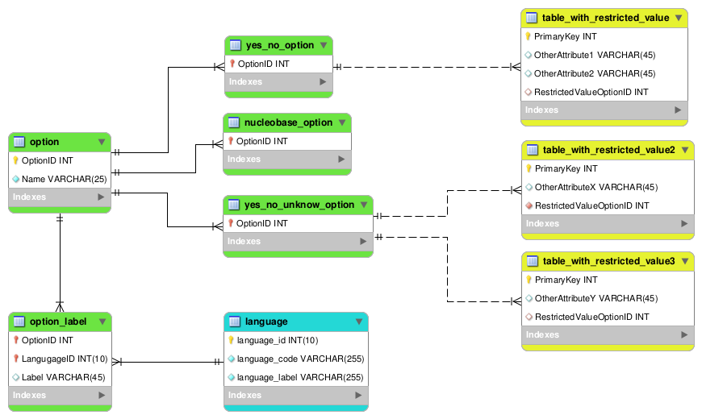

### Overview

This document details the modeling conventions to use for tables, attributes
and constraints definition in the Loris SQL database. These guidelines should
be followed when submitting a Pull Request to the Loris repository as well
as when reviewing the PR of a peer developer.

***Disclosure:** Due to the previous lack of standard in modeling,
we acknowledge that existing tables do not abide by the rules described
below. As the codebase and database are being cleaned-up, the existing
infrastructure will be re-designed to follow this guideline.*

### Tables

- The table name should be in **snake_case**.  
  - The table name should be in **lowercase**.
  - The table name made of **multiple word** should use an **underscore** 
  in order to separate each of them.
- The table name should be in **singular form**.
- The table name should contain **English words** only.
- The table name should **not contain abbreviation** with the exception of 
  "\_rel" for entity relationship tables.
- The table name should be a **noun** or **group of nouns**, as concise as 
  possible.
- When a **single word is not sufficient** to describe a table, the ordering 
  of the words in the name should reveal the concern of the table in a 
  broad-to-specific manner. 
  - *i.e. A table containing the consent information of a candidate would be 
    named `candidate_consent`, candidate being the broader concern and just 
    `consent` is not sufficiently  informative to rule out user consents and 
    examiner consents. A table containing the consent types would be called 
    as such `consent_type`.*
- A table that is **specific to a module** should be **prefixed** with the 
  module name.
  - *i.e. A table named `xyz` used in module `abc` should be name `abc_xyz`.*
- **Acronyms** should be avoided, however may be used when the acronym would 
  be **commonly used by the neuroimaging community**. The acronym should
  **only contain upper case letter**. For historic reasons, “PSC” to refer to 
  a Site is an exception to this rule.
- When creating a table representing a **relation between two or more tables**. 
  Regardless of the relation type (many-to-many, one-to-many, many-to-one or 
  one-to-one), the table should have a composite name as such 
  `table1_table2_rel`.
  - *i.e. the table mapping users to their addresses would be named 
  `user_address_rel` where `user` is the name of the Users' entity table and 
  `address` is the name of the Addresses' entity table.*

### Fields

- The field name should be in **CapitalizedWords**.
  - The field name should **start** with an **Upper case letter**.
  - The field name should **not contain any underscore**.
- The field name should be in **singular form**.
- The field name should contain **English words** only.
- The field name should **not contain abbreviations**.
- **Acronyms** should be avoided, however may be used when the acronym would 
  be **commonly used by the neuroimaging community**. The acronym should 
  **only contain upper case letter**.
- The **primary key** field of a table should be named `<TableName>ID`. While 
  the table name is snake_case, the field names referencing it (such as the 
  primary key) should follow field naming conventions. (ie. `my_table`’s 
  primary key should be `MyTableID`).
  - *i.e. the name of the primary identifier of the `country` table should be 
  `CountryID`.*
- When an explicit auto-incremented primary key field is present, it should be
  of type unsigned int. Most tables should have an explicit primary key field.
- When adding a field which serves as a **foreign key to another table**
  in the database, the field should follow the same convention as above
  `ReferenceTableNameID`.
  - *i.e. The `country` table would have a primary identifier field named
  `CountryID` and another table a foreign key reference to the `country`
  table with a field named `CountryID`.*
- When two(2) fields refer to the **same foreign key id**, a qualifier should
  be added to the names.
  - *i.e. Two fields pointing to the `CountryID` in the same table should
  be named like in `OriginCountryID` and `DestinationCountryID`.*
- Both **primary key and foreign key** fields should end with **`ID`**
  in upper case.  
- **Date** fields should not just be named “Date”. A
  **qualifier** like “BoughtDate” or “DateAccepted” should be added as
  required.  
- **No ENUM attributes** should be used in the default LORIS schema
  or modules. Instead a lookup table to refer to possible choices should be used.
  (See section below for when ENUM is needed.)

#### Field Ordering

- The primary key is always in the first field.
- The foreign key field(s) follow the primary key.
- Other indexed fields (Unique and Index key) are after the primary and foreign 
  key if present. Fields that are part of a composite key should be positioned 
  together as much as possible.
- Other fields follow. 
- Text, Json and Blob are the last fields in that order when present.
- Mandatory fields should generally be place before optional fields
- Within each section, it recommended but not an obligation that fix size fields 
  are to be positioned before variable size fields (Numeric, Date and Char before 
  Varchar).  

### Constraints

- A **foreign key** constraint definition should contain `ON DELETE` and 
  `ON UPDATE` clause. Do not rely on default behavior.

#### Naming
- Although not an enforced rule, recommandation for naming constraint are 
  as follow:
  - The constraint name should be **specifically declared**.
  - The constraint name should be in **singular form**.
  - The constraint name should be of the **proper format**:
    - **Primary key** `PK_<table_name>`
    - **Unique key** `UK_<table_name>_<ColumnName(s)>`
    - **Foreign key** `FK_<table_name>_<ColumnName>`
    - **Check constraint** `CK_<table_name>_<ColumnName>_<Check>`

### ENUM replacement

- A **base lookup table** (`option`) exist to store all possible values for 
  every enum requirement.
- When an ENUM type field is needed, create a **second level** lookup table 
  (i.e., `yes_no_option` for `yes` and `no` values) with a single attribute
  referencing the **primary key** attribute of the `option` table. That second 
  level table will only store the `OptionID` of the required values. In the 
  table that require an ENUM type attribute, make a **foreign key** constraint 
  referencing that **second level table**. This will only permit value 
  reference in the second level table. You may first check if an existing 
  second level table already as the proper options.
- The **name** of these **second level table** should end in `_option`.
- **Multiple table** could reference the **same second level table** 
  (i.e., `yes_no_option`) as required.
- If you later have to **modify an existing list** of optional value (second 
  level table), you may add (remove) the primary key of the option to the 
  second level table. **Be carefull**, it is possible that **other tables 
  reference** this existing second level table. In that case, **create a 
  new** second level table with the now desired options and modify the 
  reference of the restricted attribute to point to the newly created second 
  level table.
- Add **additionnal optional values** in the `option` table as required. 
  **Before** doing this, you should **check** if it already exist.

- The `option` table should only contain the name (used inside the code) of 
  the value. The **label** (`Label` attribute of `option_label`table) should
  be **displayed on the screen**. This label can exist in multiple language.
  **Always create** an entry for the **en-CA** (English Canada) language 
  in the `option_label` table. You may **add translation** to other language 
  **as desired**.

  
### Other parameters
- Tables should be normalised to **3rd normal form**  unless there is a strong
  justification to do otherwise.
- Engine should be **InnoDB** (`ENGINE=InnoDB`) for all tables unless specific
  requirements demand otherwise.
- The character encoding used by LORIS should be UTF-8. This implies that MySQL 
  tables should use CHARSET=’utf8mb4’ (note the mb4). If the mb4 variant causes 
  MySQL row size violations, CHARSET=’utf8’ may be used. (However, these 
  exceptions should be rare outside of “legacy” tables due to the 3NF 
  requirement.)
- Be **explicit** instead of implicit.

