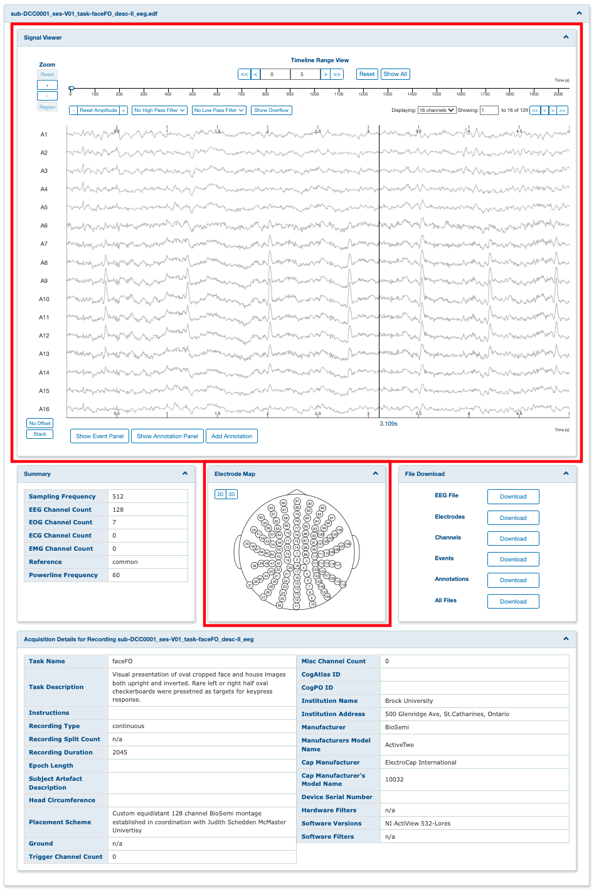
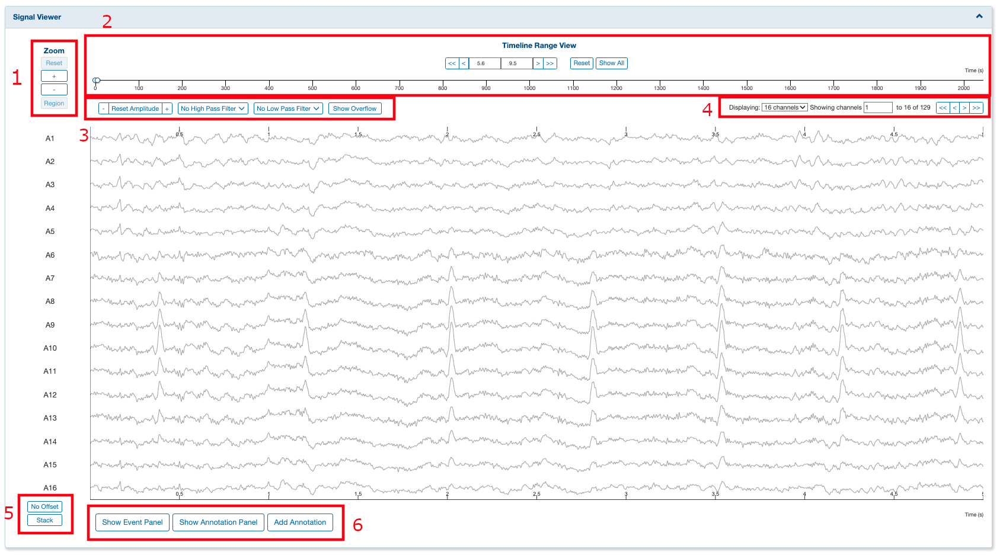
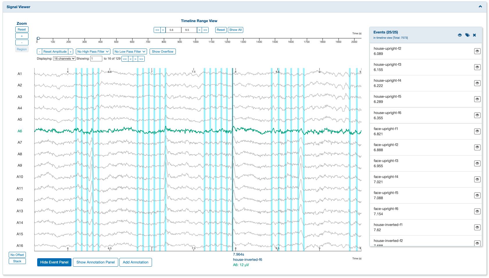
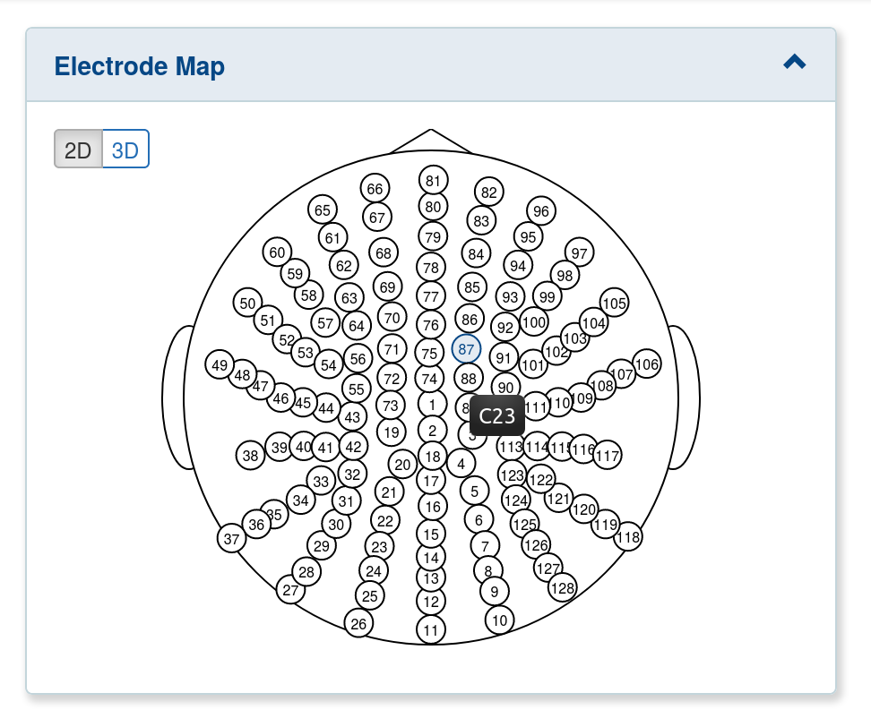
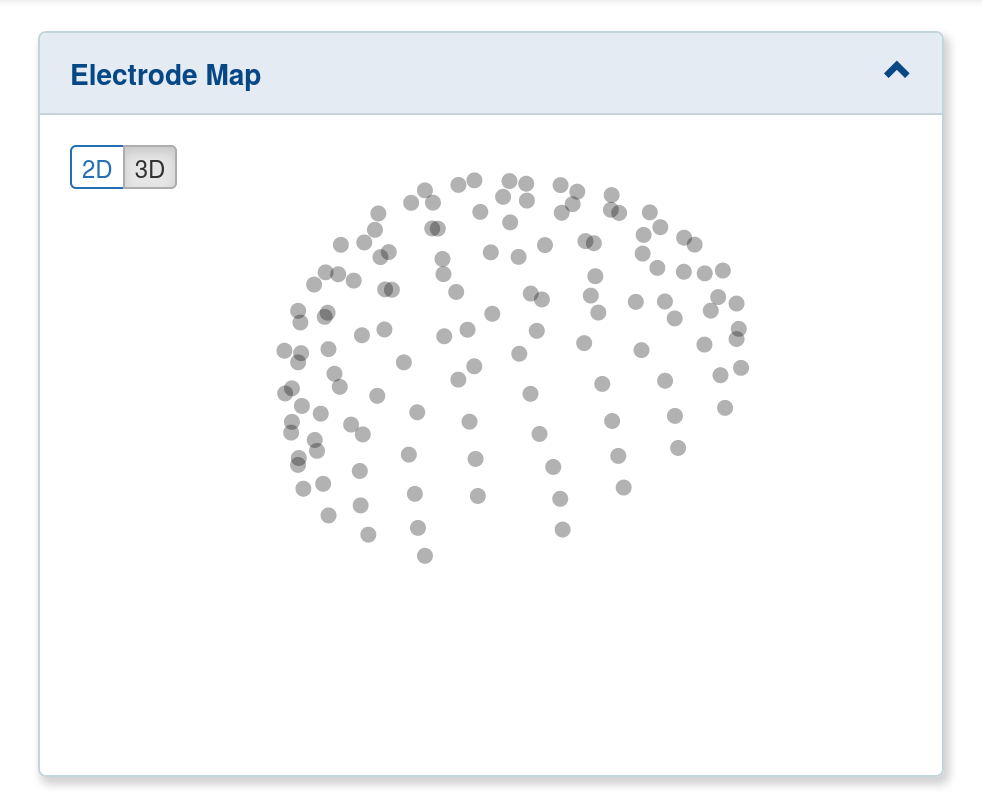

# EEG Browser Visualization

## Installation requirements

The visualization components require Protocol Buffers v3.0.0 or higher.
For install instructions, you can refer to the Protocol Buffers GitHub page: https://github.com/protocolbuffers/protobuf

To enable the visualization components, set the `useEEGBrowserVisualizationComponents` config (Configuration/GUI) to true and run `make dev` or `npm install && npm run compile` from the loris root directory.

## Main dependencies

- [Ramda](https://ramdajs.com)
A practical functional library for JavaScript programmers.

- [Redux](https://redux.js.org):
A Predictable State Container for JS Apps

- [Visx](https://airbnb.io/visx):
A collection of expressive, low-level visualization primitives for React.

- [RxJS](https://rxjs-dev.firebaseapp.com/guide/overview):
RxJS is a library for composing asynchronous and event-based programs by using observable sequences. 
It provides one core type, the Observable, satellite types (Observer, Schedulers, Subjects) and operators to allow handling asynchronous events as collections.

- [TypeScript](https://www.typescriptlang.org)
A static type checker for javascript.

- [Protocol Buffers](https://developers.google.com/protocol-buffers)
To install the Protocol Buffers Compiler (protoc), run:
`apt install -y protobuf-compiler`

##  User manual

The EEG Browser visualization component adds support for some useful visual helpers: The **Signal Viewer** and the **Electrode Map**.

### Signal Viewer
   
Several tools can be used to navigate through the Signal Viewer:
 - The **Timeline Range View** (1) can be used to change the boundaries of the viewed timeline.
 - The **Amplitude** and **Filter** tools (2) can be used to increase/reduce the amplitude scale and apply high or low-pass filters.
 - The **Channel navigation** (3) can be used to navigate through the viewed channels.
 - The **Event Panel** (4) can be used to display information about the events when event data is available.
 - If the selected timeline range contains more than 100 events, a message (5) indicates the user to reduce the boundaries of the timeline in order to display the event data.
  

   
  Signal Viewer with signal values and event data displayed.

### Electrode Map 
The current implementation of the Electrode Map supports 2 display modes: 2D and 3D.

| 2D View | 3D View |
|:-------------------------:|:-------------------------:|
|  The 2D view is a stereographic projection of the electrodes position. Electrodes are indexed and their name is displayed on mouse hover.  |   The 3D view displays the exact position of the electrodes on the brain. |

### Future developements to come

A signal annotation feature is currently under development. 
